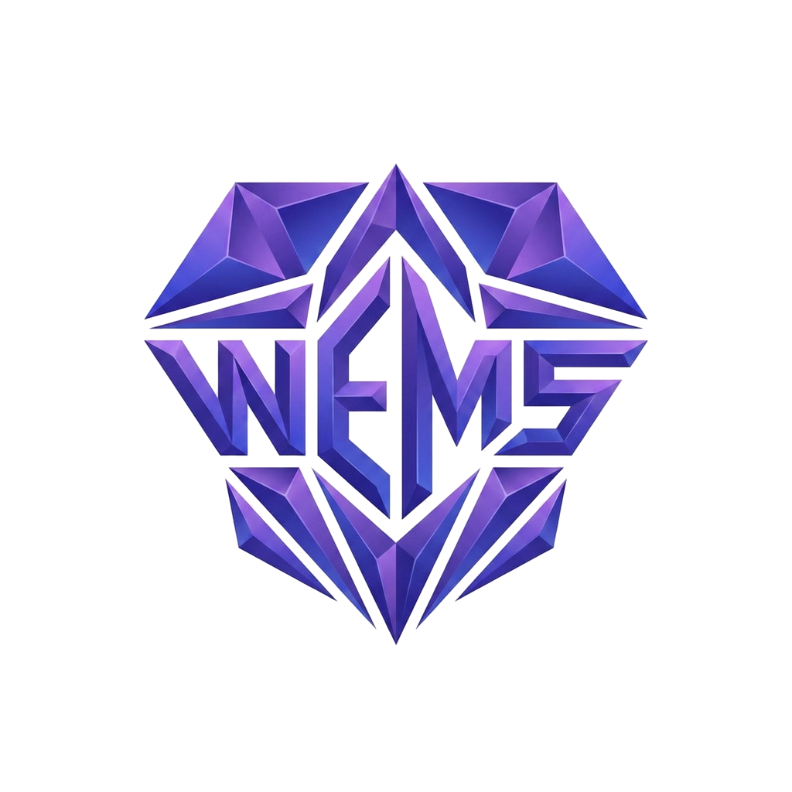

# WILLIAM SEBASTIÃO

 

&nbsp;

&nbsp;

&nbsp;

 

<h2>▸ About</h2>

> Data professional at the intersection of **Analytics Engineering** and **Data Analytics**, with experience in high-complexity environments. My focus is building **end-to-end data solutions** — from ingestion and transformation to modeling and analytical delivery.
>
> I bridge technical teams and business areas, translating complex problems into clear, actionable data solutions. I care about making data **reliable**, **scalable**, and truly used in business decisions.

*"The value of data lies in building a solid foundation that enables fast, reliable, and scalable decision-making."*

---

<h2>▸ Core Stack</h2>

  

---

<h2>▸ Skills & Expertise</h2>

**☁️ Cloud & Architecture**

**⚙️ Data Engineering**

**📊 Analytics & BI**

**🛡️ Governance & Tools**

---

<h2>▸ GitHub Activity</h2>

  

 

  
  &nbsp;
  

  

  

---

<h2>▸ Connect</h2>

---

  Chemical Engineer · UNIFEI &nbsp;|&nbsp; 🇧🇷 PT (Native) · EN (Intermediate) · ES (Intermediate)

