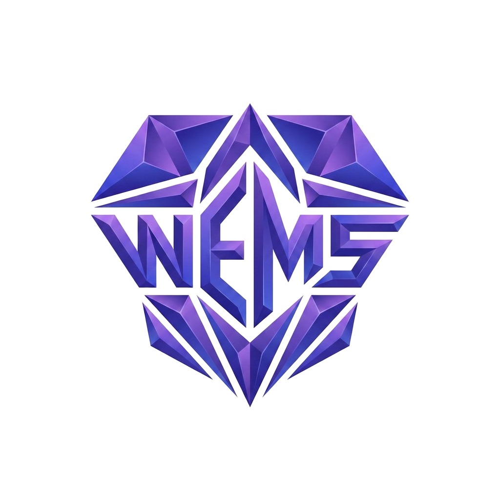

# William Sebastião

**Analytics & Data Engineer** — São Paulo, Brazil 
4 years building end-to-end data solutions for high-volume B2C products.

<!-- TODO: adicionar e-mail e CV quando estiverem definidos, ex.:

-->

## ▸ About

Analytics & Data Engineer with **4 years** building end-to-end data solutions for high-volume B2C products — from raw ingestion to governed, self-service analytics that teams actually use to make decisions.

**Currently**
- 💼 Open to **Analytics Engineer / Data Engineer** opportunities
- 🏗️ Focused on **lakehouse architecture, data modeling and semantic layers**
- 🛡️ Advocating **data quality, governance and documentation** as part of the product

## ▸ What I Do

**⚙️ Data Engineering**
- Design **lakehouse pipelines** in a medallion architecture (bronze → silver → gold) with PySpark and dbt
- Build **ETL/ELT and API ingestion** orchestrated with Airflow and Databricks Workflows
- Ship data with **CI/CD and automated quality tests**, so pipelines stay reliable at scale
- Structure data domains on **BigQuery and Snowflake** following **Data Mesh** principles

**📊 Analytics Engineering**
- Model data into **semantic layers and single sources of truth** for business KPIs
- Standardize **metric and dimension definitions** so every team reads the same numbers
- Deliver **self-service dashboards** in Tableau, Power BI and Looker, built on reusable templates
- Turn data into decisions with **statistical analysis, clustering (K-means) and data storytelling**

## ▸ Featured Projects

<!-- TODO: preencher 2–4 projetos (problema, stack e resultado) e remover este comentário em volta da tabela.

| Project | Problem | Stack | Result |
|---|---|---|---|
| [project-name](https://github.com/Wems94/project-name) | One sentence on the problem solved | BigQuery · dbt · Airflow | Measurable outcome or key learning |
| [project-name](https://github.com/Wems94/project-name) | One sentence on the problem solved | Python · PySpark · Databricks | Measurable outcome or key learning |
-->

*Selected projects coming soon — see my [repositories](https://github.com/Wems94?tab=repositories).*

## ▸ Tech Stack

  

**Data Engineering** 

**Cloud & Data Platform** 

**Analytics & BI** 

**Governance & Collaboration** 

**Architecture & Modeling:** Lakehouse · Medallion architecture · Data Mesh · Semantic layer · Dimensional data modeling · ETL/ELT · API integration · Data quality testing · Data storytelling

## ▸ GitHub Activity

  <picture>
    <source media="(prefers-color-scheme: dark)" srcset="https://github-readme-stats.vercel.app/api?username=Wems94&show_icons=true&hide_border=true&count_private=true&bg_color=00000000&title_color=00d4ff&icon_color=7b2fff&text_color=c9d1d9" />
    
  </picture>
  <picture>
    <source media="(prefers-color-scheme: dark)" srcset="https://github-readme-stats.vercel.app/api/top-langs/?username=Wems94&hide_border=true&layout=compact&langs_count=8&bg_color=00000000&title_color=00d4ff&text_color=c9d1d9" />
    
  </picture>

---

  Chemical Engineer · UNIFEI &nbsp;|&nbsp; 🇧🇷 Portuguese (native) · English (intermediate) · Spanish (intermediate)

